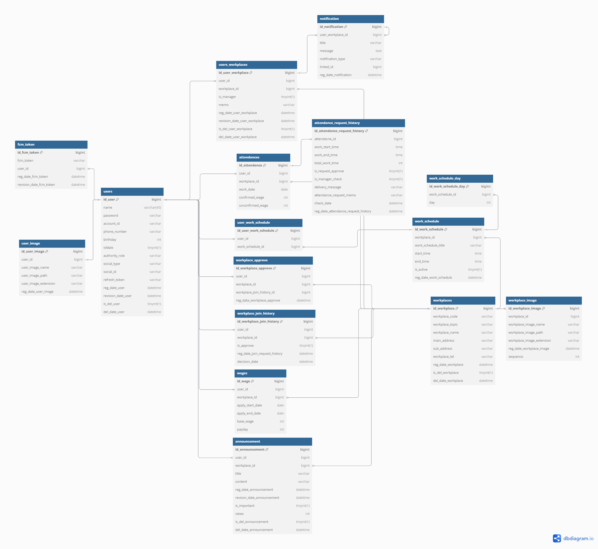

# Seulmae_API

---

## 🪄 01 - 프로젝트 소개

**프로젝트 소개**

💡 **아르바이트생의 출퇴근 및 급여 관리 등 편리한 기능을 제공하여 매니저의 근무지 관리를 돕는 서비스**

**주요 기능**

- **알바생 출퇴근 신청 서비스**: 아르바이트생은 한 번의 클릭으로 출퇴근을 입력하고, 출퇴근 이력을 손쉽게 확인할 수 있습니다.

- **매니저 출퇴근 승인 서비스**: 매니저는 실시간으로 아르바이트생의 출퇴근을 승인, 거절, 보류할 수 있으며, 리스트에서 승인 여부를 직관적으로 확인할 수 있습니다.

- **출퇴근 자동 승인 서비스**: 지정된 일정에 근무하는 아르바이트생은 자동으로 출퇴근이 승인되어, 매니저의 별도 확인 없이도 관리가 가능합니다.

- **급여 계산 서비스**: 월별, 일별 급여 계산을 통해 아르바이트생은 자신의 급여를, 매니저는 각 아르바이트생의 급여를 한눈에 확인할 수 있습니다.

- **근무지 관리 서비스**: 아르바이트생의 가입 승인, 근무 일정 설정 등 근무지와 관련된 다양한 관리 기능을 제공합니다.

---
## 📌 02 - 기술 스택
### 💻 Backend
#### BackEnd

#### CI/CD & DevOps

#### DataBase

#### API

#### TEST

#### Version Control / etc

---

## 🚀 03 - 서비스 아키텍처

---
## 🕹️ 04 - 성능 개선
- [JMeter 성능 테스트를 통한 개선](https://velog.io/@jin-young/JMeter-성능-테스트를-통한-개선)

## 🎯 05 - 트러블 슈팅
- [알림 서비스 분리의 필요성](https://velog.io/@heager/TEAM-PJT-Spring-Event)
    - [SpringEvent transaction 문제](https://velog.io/@heager/TEAM-PJT-Spring-Event-주의할-점)

- [Spring Security와 JWT를 활용한 일반 및 소셜 로그인 통합 인증 시스템 구현]
  - [소셜로그인 OICD 적용기]

- [빌드할 때, 환경이 달라서 발생한 문제](https://velog.io/@heager/TEAM-PJT-FileInputStreamClassPathResource)

- [통합 테스트 과정에서의 더미데이터](https://velog.io/@jin-young/통합-테스트-과정에서의-더미데이터)

---

## 🛠️06 - API & ERD

- **API 명세서**
  - [Postman API Document](https://documenter.getpostman.com/view/36219904/2sA3drHufv)
- **ERD**

## 07 - 관련 링크

